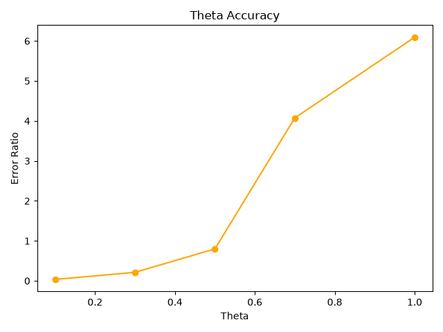

# Phase 2: Numerical Integrator Selection

## Options Considered
* Euler integration
* Leapfrog integration

## Chosen Architecture
**Leapfrog Integration** was selected for the core physics simulation loop.

## Technical Justification

## Algorithmic Mechanics
Euler Integration is a first-order numerical procedure which works by predicting the expected answer in a short period in the future by using the current velocity and position. This causes non-conservation of energy; it adds energy since a linear path is assumed across an entire step. 

On the other hand, Leapfrog Integration is a second-order symplectic numerical procedure which works by performing Kick, Drift, Kick. This prevents energy drift and greatly reduces the percentage of error by bounding the error amplitude rather than letting it accumulate monotonically.

## Performance Metrics (20-Year Horizon)

| Metric | Euler Integration | Leapfrog Integration | Performance Delta |
| :--- | :--- | :--- | :--- |
| **Energy Error %** | Over 60% error | 0.028% error | **2000x difference** |
| **Error Behavior** | Continuous drift (adds energy) | Bounded amplitude | Constant stability |

## Empirical Evidence

---

# Phase 3: Trail Optimization

## Options Considered
* Standard Python `list` with manual bounds checking (`list.pop(0)`)
* `collections.deque` with a fixed `maxlen`

## Chosen Architecture
A **`collections.deque(maxlen=500)`** was implemented to manage the historical coordinates of the celestial bodies.

## Technical Justification

## The Problem with Standard Lists
Using a normal list forces Python to drag every single old coordinate forward in memory every time the trail exceeds the specified length. When calling `list.pop(0)`, the item at index `0` is removed, meaning that Python must shift every remaining coordinate down a slot to keep the array continuous in memory. This introduces an $O(N)$ linear time penalty on every frame update, creating unnecessary strain on the CPU as the simulation continues.

## The Deque Advantage
A `deque` with a fixed `maxlen` removes this performance bottleneck entirely. It pushes memory management entirely down to the C-level, automatically dropping the oldest position point off the front of the queue the second a new point is appended to the back. Because a deque is a doubly-linked structure, inserting to the back and popping from the front are guaranteed $O(1)$ constant-time operations.

## The Zoom Integration
Since the trail history is strictly capped at a maximum of 500 points per body, the computational efficiency per frame remains optimal. Instead of managing a complex pixel cache that would require a full recalculation every time the camera zoom changes, the engine safely converts raw coordinates (meters) to screen coordinates (pixels) on the fly. For a standard setup of 9 celestial bodies, this requires fewer than 4,500 basic calculations per frame—a negligible processing load that ensures the simulation display maintains a smooth, stable 60 FPS.

# Architectural Decisions Log

---

# Phase 4: N-body Complexity & Profiling

## The Question
What is the bottleneck in the simulation and what can be done about it?

## Options Considered
- Keep $O(N^2)$ but vectorize with NumPy (Complexity stays the same but constants are faster)
- Implement Barnes-Hut quadtree(Reduces the complexity to  $O(N \log N)$
- Do Both

## Chosen Option
Do both. Implementing a Barnes-Hut quadtree reduces the actual complexity to $O(N \log N)$ while NumPy improves the speed of the constant. Both approaches address seperate bottlenecks, making the hybrid choice the most optimal for efficiency. 

## Why?
Using Barnes-Hut quadtree improves the complexity of the algorithms to be significantly more efficient. With the brute-force option of $O(N^2)$ when N = 100, ncalls were at 247,500 calls. N= 200, ncalls = 995,000, and finally at N = 500, ncalls were at an alarming 6,237,500 which took 33.07s to complete. Barnes-Hut would greatly reduce the computational load exerted. Gravitational_force is the real bottleneck which has all the calculations, force computation, and the operations. NumPy calculates the forces across all pairs in C, removing each pair's Python object creation and overhead that quickly piles up at high n.

## Empirical Evidence
| N | Time (s) | `gravitational_force` calls |
|---|---|---|
| 100 | 1.228 | 247,500 |
| 200 | 4.916 | 995,000 |
| 500 | 33.074 | 6,237,500 |

---

# Phase 5: Bottleneck Resolution

## The Question
What is the most effective strategy to resolve the $O(N^2)$ gravitational force bottleneck identified in Phase 4?

## Options Considered
- Barnes-Hut quadtree alone — reduces complexity to $O(N \log N)$ but written in pure Python
- NumPy vectorization alone — complexity stays $O(N^2)$ but constants are faster via compiled C
- NumPy + Barnes-Hut hybrid — reduce both complexity and constants

## Chosen Architecture
NumPy vectorization at current scale (N≤500), with Barnes-Hut retained for future hybrid integration.

## Technical Justification
NumPy replaces the Python loops which was the main culprit with bulk C operations on arrays. The C operations on these arrays were processed in one C call, therefore bypassing the interpreter from the inner loop.

## Empirical Evidence

### Barnes-Hut vs O(N²)
| N | O(N²) Time (s) | Barnes-Hut Time (s) | Ratio |
|---|---|---|---|
| 100 | 1.228 | 6.867 | 5.6x slower |
| 200 | 4.916 | 21.566 | 4.4x slower |
| 500 | 33.074 | 100.126 | 3.0x slower |

### NumPy vs O(N²)
| N | O(N²) Time (s) | NumPy Time (s) | Speedup |
|---|---|---|---|
| 100 | 1.228 | 0.052 | 23x faster |
| 200 | 4.916 | 0.163 | 30x faster |
| 500 | 33.074 | 0.835 | 39x faster |

## Theta Parameter Selection
To determine optimal theta value, a benchmark was run at `N=500` measuring the mean force deviation percentage against the brute force method $O(N^2)$ across five potential values. A range of 0 to 1 was chosen for this test to represent the full range of the parameter. As shown in the benchmark below, the error margin between $\theta$ = 0.5 and $\theta$ = 0.7 spiked tremendously. While the error margin between $\theta$ = 0.3 and $\theta$ = 0.5 was insignificant, making $\theta$ = 0.5 the point where accuracy starts degrading sharply. The choice of the theta parameter is consistent with modern Barnes-Hut practices. While the original J. Barnes & P. Hut, Nature 324, 446–449 (1986) paper used $\theta$ = 1.0, modern N-body implementations coalesce on 0.5-0.7 as the accuracy-performance equilibrium, a range this benchmark independently confirms.    

| $\theta$ | Mean Force Error % |
|---|---|
| 0.1 | 0.0152 |
| 0.3 | 0.0204 |
| 0.5 | 0.0270 |
| 0.7 | 0.0473 |
| 1.0 | 0.0953 |

# Phase 6: 3D Migration

## The Question
How can this project be evolved into the 3D world?

## Options considered
**Projection:**
- Orthographic
- Perspective 

**Camera rotation:**
- Azimuth/Elevation angles
- Full 3x3 rotation matrix 

**Spatial partitioning:**
- Octree with 8 named children(`self.nw`, `self.ne `x8)
- Octree with `list(8)` and bitwise indexing

**Initial Z conditions:**
- `z=0`
- Random Gaussian z offset for disk thickness

**Octree size limit:**
- Keep size limit, drop bodies below minimum cell size
- Remove size limit, allow full recursion

## Chosen Architecture
- Orthographic Projection
- Azimuth/Elevation Angles
- Octree with `list(8)` and bitwise indexing
- Random Gaussian z offset for disk thickness
- Remove size limit, allow full recursion

## Technical Justification
- Orthographic Projection was chosen over perspective projection due to the side effect of perspective projection where it distorts the size of the object relative to the distance. Although that is the correct nature, the project prefers accurate spatial relationships
- Azimuth/Elevation Angles were chosen over a full 3x3 rotation matrix because azimuth and elevation angles give straightforward orbital viewing controls with two parameters instead of the nine matrix values that a 3x3 would have
- Octree with `list(8)` and bitwise indexing was chosen over 8 children due to the nested if/elif chains of up to 8 comparisons to find the right child; bitwise indexing collapses the conditions into a simple integer, making the child lookup $O(1)$. It utilizes three boolean comparisons, `x > cx, y > cy, z > cz` , are combined into a single integer 0–7 that directly connects to the correct child index, eliminating any if/elif branching.
- Random Gaussian z offset for disk thickness was chosen over `z=0` to give visual depth to the galaxy
- Remove size limit, allow full recursion was chosen over keeping the size limit to prevent bodies dropping while they are spaced together closer than the minimum allowable cell size

## Empirical Evidence

