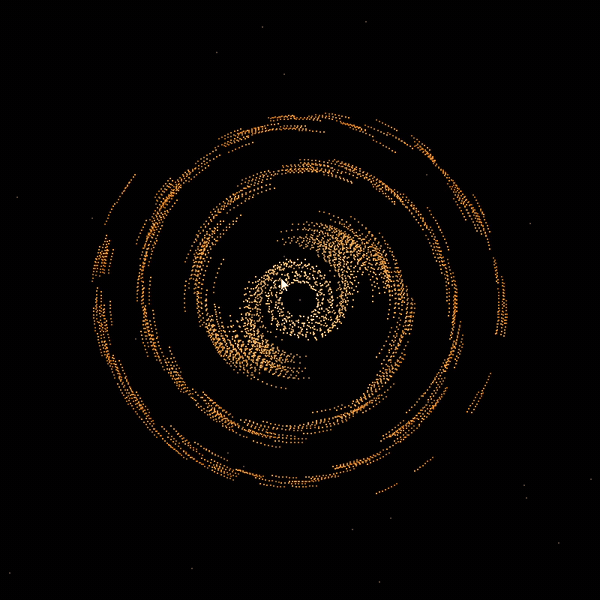
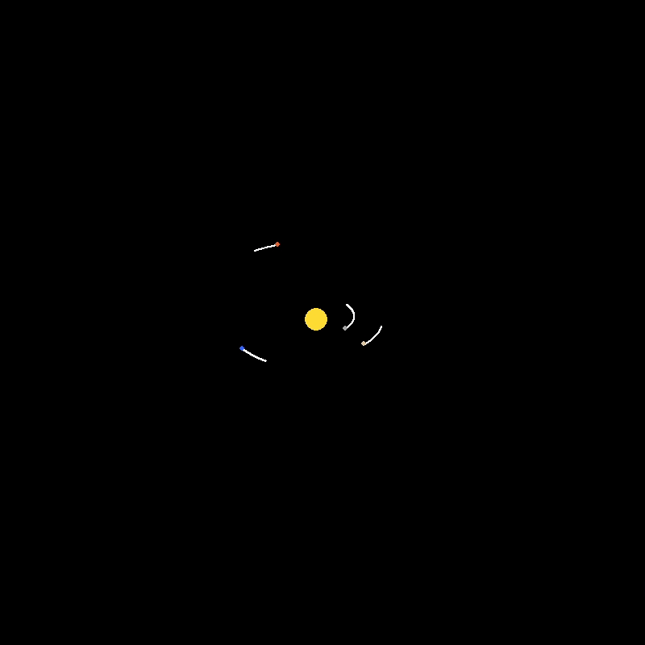
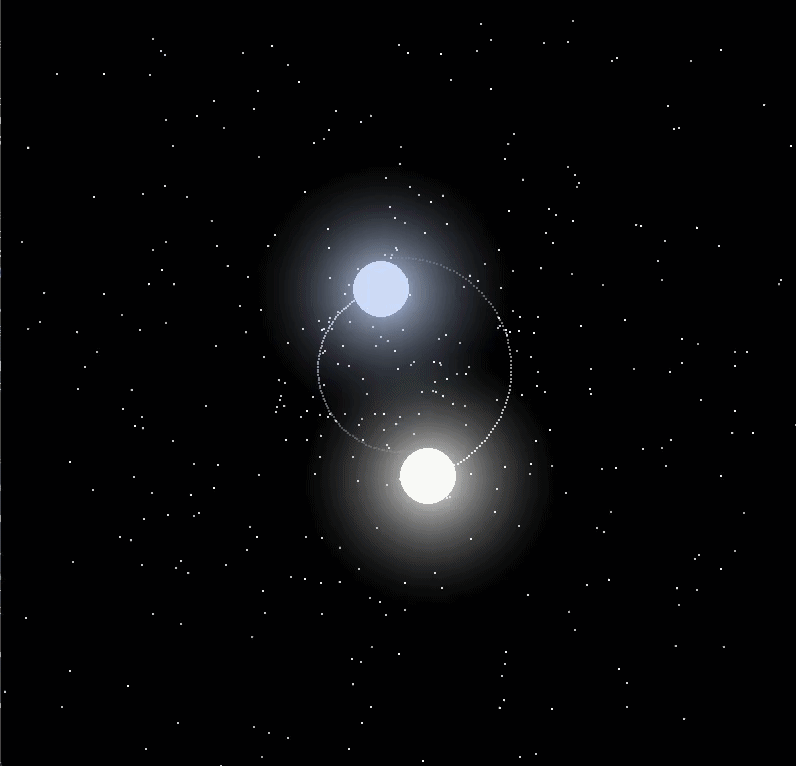
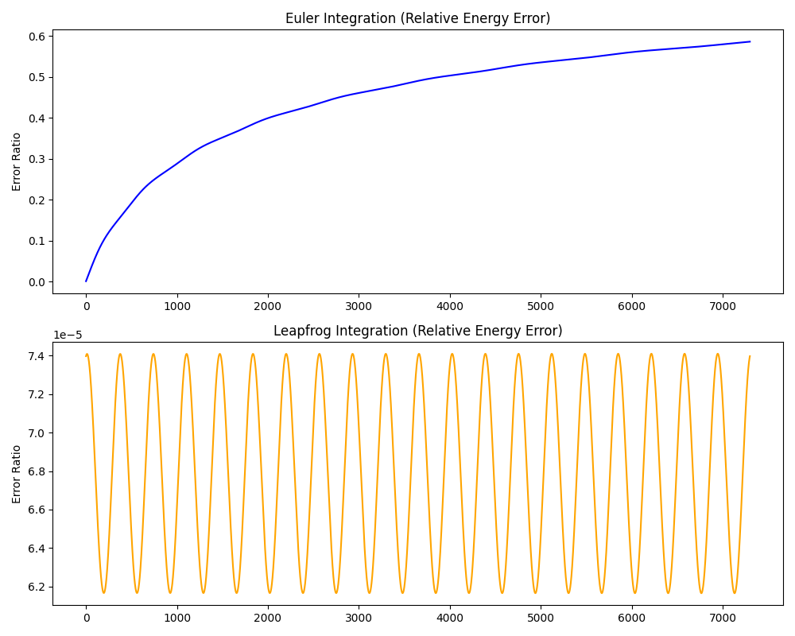

# Space Simulation

## Stardance 2026
**New pulsar and neutron-star extension written in C++. View the extension repository here: [Space_Sim_C++](https://github.com/Coverst-ux/Space-sim-Cpp-Port)**

I used AI for reviewing, planning, debugging advice, and research while making sure I understood everything that was said before applying it.

## Galaxy/N-body Simulation


## Solar System Simulation



## Binary-Merger Simulation


A 3D gravitational N-body simulation engine implementing Leapfrog (Störmer-Verlet) integration and the Barnes-Hut spatial partitioning algorithm ($O(N \log N)$). The C++ physics backend achieves up to a **6.1× speedup over the NumPy implementation at N=1,300**, building on an earlier **39.6× improvement achieved by NumPy over the pure-Python brute-force implementation at N=500**. Orbital accuracy validated against NASA Planetary Fact Sheet data across all 8 planets, with a maximum period error of 1.1% on Neptune's 60,182-day orbit.

## Performance

> **Note:** (OUTDATED) Barnes-Hut underperforms at N=500 due to pure Python tree construction and recursive traversal overhead, this is expected behavior at low N. See [Design Decisions](#design-decisions) for full analysis.

| Method | Time (N=500, 50 steps) | Relative Speed |
|---|---|---|
| O(N²) pure Python | 33.07s | baseline |
| NumPy vectorized | 0.835s | 39.6x faster |
| Barnes-Hut pure Python | 100.1s | 3x slower |

## Performance History

### Phase 1: Pure Python → NumPy (N=750)
(OUTDATED) At N=750, NumPy vectorization dominates by replacing Python-level loop dispatch and per-pair object allocation with contiguous memory operations executed by compiled C routines. Although Barnes-Hut reduces force evaluation complexity from $O(N^2)$ to $O(N \log N)$, its advantage is outweighed at this scale by octree construction and recursive traversal costs in pure Python. The implementation demonstrates the algorithmic architecture and expected scaling behavior, but interpreter overhead prevents reaching the particle counts where asymptotic gains dominate. This motivates the planned NumPy + Barnes-Hut hybrid implementation described in the Design Decisions section.

### Phase 2: NumPy → C++ (N=750+)
NumPy's 39.6x speedup was great at N=750 recording a stable 30 fps, but it hit a hard performance ceiling as N grew. Python overhead that vectorization couldn't fully escape at higher N was stagnating any improvements to the stability and performance of the simulation. After a few brainstorming sessions, porting the main physics core into C++ was chosen as the next concrete step. Various things such as the Leapfrog integrator, gravitational physics, and the Barnes-Hut spatial partitioning algorithm were all fully rewritten in C++. Instead of programming the whole simulation project from scratch, pybind11 was used as a bridge to Python so the existing Pygame rendering pipeline didn't need to be rewritten.


Repo -> 
[](https://github.com/Coverst-ux/Space-sim-Cpp-Port) 

## C++ Performance
The C++ physics backend was benchmarked against the previous NumPy implementation using identical conditions and 50 Leapfrog integration physics steps (loops).
| Bodies (N) | NumPy (50 steps) | C++ (50 steps) | NumPy per Step | C++ per Step | Speedup |
|---:|---:|---:|---:|---:|---:|
| 750 | 1.720 s | 0.404 s | 34.4 ms | 8.1 ms | **4.3×** |
| 1,300 | 4.913 s | 0.809 s | 98.3 ms | 16.2 ms | **6.1×** |

At 750 bodies, the C++ implementation calculated 50 physics steps in 0.404 s, compared with 1.720 s for the NumPy implementation.

At 1,300 bodies, C++ completed the same workload in 0.809 s, compared with 4.913 s for NumPy.

This corresponds to a 4.3× speedup at N=750 and a 6.1× speedup at N=1,300. The increasing speedup at higher body counts indicates that the C++ implementation scales more favorably for this workload.      


The benchmark excludes rendering costs and purely records the computational cost of the physics loop.

**Benchmark environment:** Python 3.14 · Intel i5-14400F · Windows 11 Pro

## Simulation Accuracy

Orbital periods were validated by tracking cumulative angular displacement ($2\pi$ radians) relative to the Sun using the second-order Leapfrog (Störmer-Verlet) integrator. Accuracy degrades for outer planets predictably, the same timestep $\Delta t$ that gives Mercury a 0.01-day error gives Neptune a 663-day error because Neptune's orbital period is 688× longer, accumulating more integration steps per orbit.

| Celestial Body | Target Period (Earth Days) | Simulated Period (Earth Days) | Absolute Error (Days) | Accuracy % |
| :--- | :--- | :--- | :--- | :--- |
| **Mercury** | 87.97 | 87.96 | 0.01 | 99.99% |
| **Venus** | 224.70 | 224.12 | 0.58 | 99.74% |
| **Earth** | 365.26 | 364.92 | 0.34 | 99.91% |
| **Mars** | 686.98 | 686.12 | 0.86 | 99.87% |
| **Jupiter** | 4,332.59 | 4,332.12 | 0.47 | 99.99% |
| **Saturn** | 10,759.22 | 10,720.96 | 38.26 | 99.64% |
| **Uranus** | 30,688.50 | 30,277.46 | 411.04 | 98.66% |
| **Neptune** | 60,182.00 | 59,518.08 | 663.92 | 98.90% |

Known values sourced from the [NASA Planetary Fact Sheet](https://nssdc.gsfc.nasa.gov/planetary/factsheet/).

## Numerical Stability

Leapfrog was selected over Euler because it is a symplectic integrator.
Over a 20-year simulation horizon, Euler accumulates approximately
60% relative energy error while Leapfrog remains bounded below 0.03%.



For the full analysis and benchmark methodology, see DECISIONS.md.

## Features

- Newtonian gravitational force calculation between bodies
- Euler and Leapfrog (Störmer-Verlet) integration implementations
- Config-driven body loading from JSON
- Pygame rendering with motion-blur orbit trails
- Decoupled physics and rendering threads via `threading.Lock` to isolate the Pygame render-viewport frame-rate from the physics integration pass
- Gravitational softening ($\epsilon$) to prevent force singularities during close encounters
- Body collision detection with momentum-conserving merges
- Random N-body generation with coherent prograde velocity distribution ($v = \sqrt{GM/r}$)
- Camera and zoom system for navigating large simulations
- Barnes-Hut $O(N \log N)$ spatial partitioning for gravitational force approximation
- NumPy vectorized force calculations eliminating per-pair Python object overhead
- Pytest coverage for gravitational force, orbital regression, and momentum conservation
- Benchmark scripts for orbital period measurement and integrator comparison

## Physics Engine

### Solar System Simulation

The Solar System simulation computes pairwise Newtonian gravity in SI units:

$$F = \frac{G m_1 m_2}{r^2}$$

Leapfrog (Störmer-Verlet) integration is used over Euler because it is a symplectic integrator, it preserves the geometric structure of Hamiltonian systems, causing orbital energy to oscillate around a stable value rather than drift monotonically. The update equations are:

$$v_{i+1/2} = v_i + \frac{1}{2} a_i \Delta t$$
$$x_{i+1} = x_i + v_{i+1/2} \Delta t$$
$$v_{i+1} = v_{i+1/2} + \frac{1}{2} a_{i+1} \Delta t$$

All bodies including the Sun are integrated each step. The Sun's displacement is negligible due to its mass dominance ($M_\odot = 1.989 \times 10^{30}$ kg) but is retained for physical correctness.

### N-body / Galaxy Simulation

The galaxy simulation uses a Barnes-Hut octree to reduce gravitational force computation from $O(N^2)$ to $O(N \log N)$. The tree recursively partitions space into octants. For each body, the tree is traversed and a node is treated as a single aggregate mass if it satisfies the Multipole Acceptance Criterion (MAC):

$$\frac{s}{d} < \theta$$

where $s$ is the node's width, $d$ is the distance from the body to the node's center of mass, and $\theta$ is the accuracy parameter (set to 0.5). The aggregate center of mass is computed as:

$$\vec{r}_{cm} = \frac{\sum m_i \vec{r}_i}{\sum m_i}$$

The closer a body is to a node, the more precisely the force is calculated, distant nodes are approximated as a single mass. NumPy vectorization replaces Python-level loops with contiguous memory operations executed via compiled C routines, eliminating per-pair interpreter dispatch and object allocation overhead.

All bodies are initialized with prograde circular orbit velocity perpendicular to their position vector:

$$v = \sqrt{\frac{GM}{r}}$$

### Gravitational Softening

To prevent force singularities during close encounters ($r \to 0$), the gravitational force is softened:

$$F = \frac{G m_1 m_2}{(r^2 + \epsilon^2)^{3/2}} \cdot r$$

where $\epsilon$ is the softening length. This bounds the maximum force at small separations while preserving accuracy at large distances.

### Current Simplifications

- Bodies are point masses, no physical radius, no rotation
- No relativistic corrections
- No gas, radiation, or non-gravitational forces
- Merges are momentum-conserving but instantaneous, no accretion disk or gradual coalescence
- Barnes-Hut $\theta$ is fixed at 0.5, no adaptive accuracy
- Orthographic projection only, no perspective

## Architecture

### Simulation Pipeline

```
JSON Config / generate_spiral()
        │
        ▼
  Body Initialization
  (position, mass, prograde velocity v = √(GM/r))
        │
        ▼
  leapfrog_step(is_first_step=True)
  Bootstrap: compute initial acceleration a₀
        │
        ▼
┌─────────────────────────────────────────┐
│           Physics Thread                │
│                                         │
│  ┌─ Kick 1:  v_{t+½} = vₜ + aₜ·Δt/2      │
│  │                                      │
│  ├─ Drift:   x_{t+1} = xₜ + v_{t+½}·Δt   │
│  │                                      │
│  ├─ Force:   a_{t+1} = F(x_{t+1})       │
│  │           Barnes-Hut O(N log N)      │
│  │                                      │
│  └─ Kick 2:  v_{t+1} = v_{t+½} + a_{t+1}·Δt/2
│                                         │
│   a_{t+1} cached → reused as aₜ          │
│   next step (no redundant tree build)   │
└──────────────────┬──────────────────────┘
                   │ threading.Lock
┌──────────────────▼──────────────────────┐
│           Render Thread                 │
│                                         │
│  world_to_screen() → camera transform   │
│  screen.set_at() → pixel rendering      │
│  blur_surface → motion trail effect     │
└─────────────────────────────────────────┘
```

The `is_first_step` flag is an architectural optimization that eliminates a redundant $O(N \log N)$ tree traversal on frame zero. Because the final acceleration $\vec{a}_{t+1}$ computed at the end of step $i$ is mathematically identical to the initial acceleration $\vec{a}_t$ required at the start of step $i+1$, it is cached and reused, the tree is built exactly once per step, never twice.

### Repository Structure

```text
space-sim/
├── src/
│   ├── core/       # Body model, gravity, integrators, Barnes-Hut tree
│   ├── io/         # JSON config loading
│   ├── rendering/  # Pygame coordinate conversion and drawing helpers
│   └── utils/      # Vector math and physical constants
├── Simulations/    # Entry points: main.py (galaxy), solar_system.py (solar system), collisions.py (binary merger)
├── tests/          # Physics, regression, and momentum conservation tests
├── benchmarks/     # Orbital period measurement, integrator comparison, C++ vs NumPy speed benchmark
├── configs/        # Simulation initial conditions (JSON)
└── DECISIONS.md    # Technical decision log
```

## Design Decisions

| Phase | Decision | Chosen | Rejected               |
|:---|:---|:---|:-----------------------|
| 1 | Numerical integrator | Leapfrog (Störmer-Verlet) | Euler                  |
| 2 | Trail data structure | `collections.deque(maxlen=500)` | `list.pop(0)`          |
| 3 | Bottleneck resolution | NumPy vectorization + Barnes-Hut | Brute force $O(N^2)$   |
| 4 | Active algorithm at N=500 | NumPy vectorized | Barnes-Hut pure Python |
| 5 | Barnes-Hut $\theta$ | 0.5 | 0.1, 0.3, 0.7, 1.0     |
| 6 | 3D projection | Orthographic | Perspective |
| 7 | Octree child indexing | `list[8]` + bitwise | Named children |
| 8 | Physics core language | C++ (pybind11 bridge) | Cython |
| 9 | Rendering pipeline | Keep in Python via pybind11 | Full C++ rewrite |

See [`DECISIONS.md`](DECISIONS.md) for full technical justification and empirical evidence for each decision.

## Running It

**Requirements:** Python 3.14.2+

```bash
# Create and activate a virtual environment
python -m venv venv
source venv/bin/activate        # Windows: venv\Scripts\activate

# Install dependencies
pip install -r requirements.txt
```
```
# Run the galaxy simulation (default)
python Simulations/main.py
```
or

```
# Run the solar system simulation
python Simulations/solar_system.py
```
or

```
# Run the binary merger / collision simulation
python Simulations/collisions.py
```

**Controls:**
- `Space` pause / resume
- `Scroll wheel` zoom in / out

Run tests:

```bash
pytest tests/ -v
```

Measure the current Earth orbital period:

```bash
python benchmarks/measure_period.py
```

## What I Learned

- **Symplectic integration matters in practice, not just theory.** Euler's energy drift isn't a textbook footnote, over a 20-year simulated horizon it accumulates over 60% energy error, making long-term orbital simulation physically meaningless. Leapfrog's bounded oscillation is the difference between a valid simulation and an invalid one.

- **Python overhead dominates over algorithmic complexity at low N.** The profiler revealed that `gravitational_force` wasn't slow because of the math, it was slow because of per-pair Python object creation and interpreter dispatch. NumPy's 39× speedup comes almost entirely from eliminating that overhead, not from a better algorithm.

- **Big-O complexity is not the same as real-world performance.** Barnes-Hut is theoretically $O(N \log N)$ vs $O(N^2)$ brute force, yet it ran 3× *slower* at N=500. The tree construction, recursive traversal, and Python object overhead cost more than the algorithmic saving at this scale. Complexity class only tells you how something scales, not how it performs right now.

- **Caching intermediate computation state is an architectural decision, not a micro-optimization.** The `is_first_step` flag exists because recomputing $\vec{a}_t$ at the start of every frame would waste an entire $O(N \log N)$ tree traversal that was already computed at the end of the previous frame. Recognizing that consecutive Leapfrog steps share an acceleration value turned a redundant calculation into a free cache hit.

<details>
<summary><strong>What I Learned — C++ Port (Phase 2)</strong></summary>

- **Precision matters at astronomical scale.** `cx/cy/cz` stored as `float` caused silent infinite subdivision in the octree, invisible in small-scale tests, but broke down at real orbital distances. Switching to `double` fixed it. A reminder that "it works in tests" isn't the same as "it works at the actual scale you're targeting."

</details>
