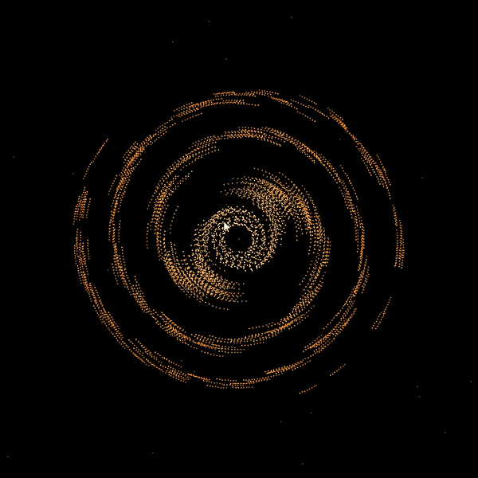
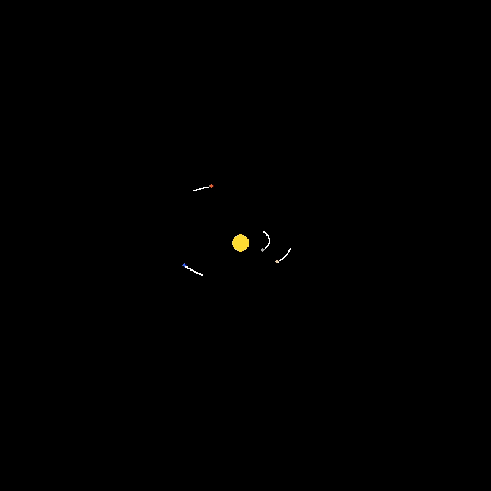
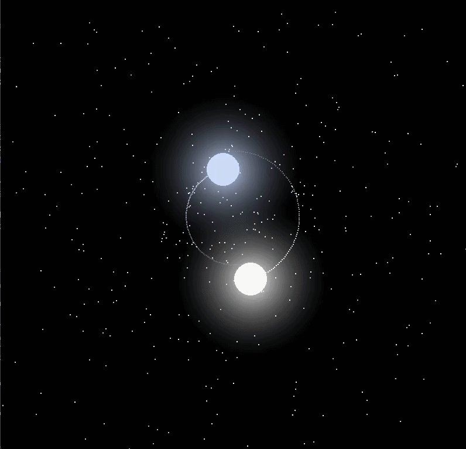
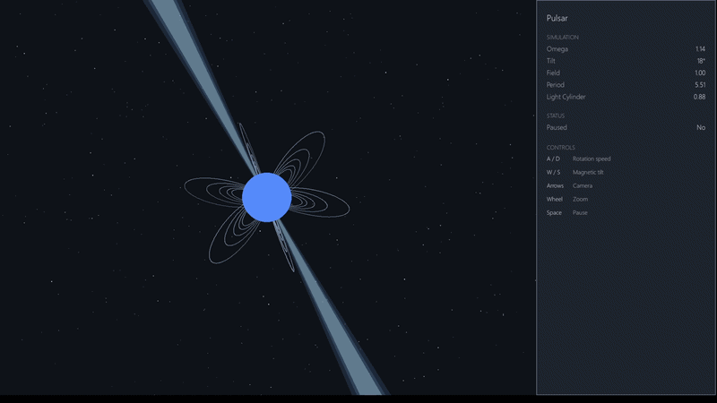
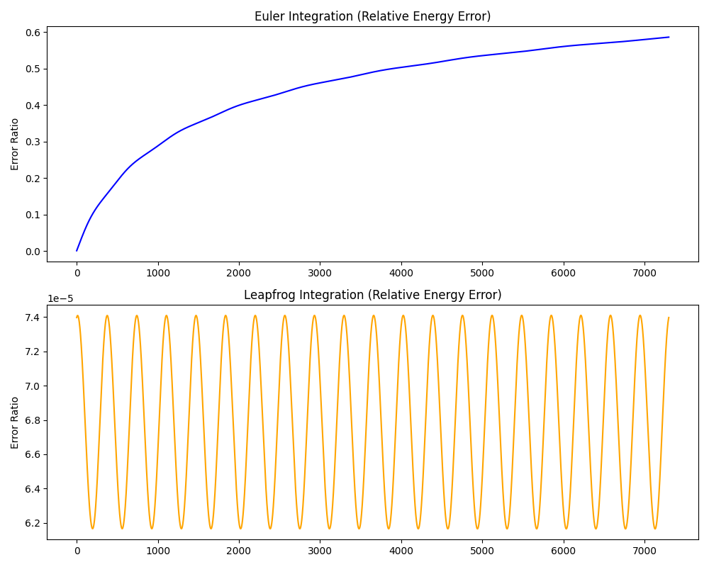

# Why I built this

 Most simple gravity simulations work fine with a few bodies, but they become painfully slow once you start increasing the particle count. I wanted to see how far I could push one while still keeping the physics accurate enough to test things like orbital stability, collisions, and galaxy-scale systems.

# What I built

Space Simulator is a 3D N-body gravity simulator with a C++ physics core and a Python/Pygame renderer. It uses a Barnes-Hut octree to reduce the cost of gravitational calculations, Leapfrog integration for better long-term stability, and includes collisions, galaxy generation, orbital scenarios, and a pulsar system I'm currently extending.

# Demos

### Galaxy/N-body Simulation


### Solar System Simulation



### Binary-Merger Simulation


### Pulsar Simulation


## Pulsar Controls

| Control | Action |
| --- | --- |
| Arrow Keys | Rotate camera |
| Mouse Wheel | Zoom |
| A / D | Decrease / increase rotation speed |
| W / S | Increase / decrease magnetic tilt |
| Space | Pause / resume |

## Download

A standalone Windows build is available through the latest GitHub Release.

Download the `.exe` and run it directly. Python is not required.

## Demo Website

**Live demo:** [Try Space Sim](https://coverst-ux.github.io/space-sim-site/)

**Demo website source code:** [View the website source](https://github.com/Coverst-ux/space-sim-site)

**The complete source code for the website is under demo_website in this repository**

## Technical features

- 3D N-body gravitational simulation
- C++ physics core connected to Python through pybind11
- Barnes-Hut octree acceleration
- Leapfrog orbital integration
- Body collisions and merging
- Solar-system and galaxy scenarios
- Binary white-dwarf merger scenario
- Pulsar visualization with magnetic field lines and rotating emission beams
- Interactive 3D camera
- Standalone Windows build for pulsar 

The current pulsar model is intentionally simplified and focuses on showing the main geometry of a pulsar rather than simulating a complete plasma magnetosphere.


---


## Performance history

### Phase 1: Pure Python → NumPy

My first implementation calculated gravitational interactions using regular Python loops. It worked, but performance dropped quickly as I increased the number of bodies.

I tested both NumPy vectorization and a pure-Python Barnes-Hut implementation. At N=500, NumPy was by far the fastest option:

| Method | Time (N=500, 50 steps) | Relative speed |
|---|---:|---:|
| O(N²) pure Python | 33.07 s | baseline |
| NumPy vectorized | 0.835 s | 39.6× faster |
| Barnes-Hut pure Python | 100.1 s | 3× slower |

Barnes-Hut had better theoretical scaling, but at this size the cost of building and traversing the octree in Python outweighed the work it saved.

That was one of the first signs that changing the algorithm alone would not be enough. The performance-sensitive parts of the simulation were still limited by Python itself.

### Phase 2: NumPy → C++

NumPy solved the first major bottleneck, but performance started dropping again as I pushed the simulation to larger body counts.

Instead of rewriting the whole project, I moved only the physics core into C++. I rewrote the Leapfrog integrator, gravitational calculations, and Barnes-Hut octree, then exposed them back to Python using pybind11.

This let me keep the existing Pygame renderer while replacing the part of the program that was actually limiting performance.

**C++ physics core:** [Space-Sim C++ Core](https://github.com/Coverst-ux/Space-sim-Cpp-Port)

### C++ benchmark

The C++ backend was benchmarked against the previous NumPy implementation using the same initial conditions and 50 Leapfrog physics steps.

| Bodies | NumPy | C++ | NumPy / step | C++ / step | Speedup |
|---:|---:|---:|---:|---:|---:|
| 750 | 1.720 s | 0.404 s | 34.4 ms | 8.1 ms | **4.3×** |
| 1,300 | 4.913 s | 0.809 s | 98.3 ms | 16.2 ms | **6.1×** |

The C++ implementation became more useful as the simulation size increased: the speedup grew from 4.3× at N=750 to 6.1× at N=1,300.

These measurements exclude rendering and only measure the physics loop.

**Benchmark environment:** Python 3.14 · Intel i5-14400F · Windows 11 Pro

## Simulation accuracy

I checked the simulator by measuring how long each planet took to complete a full \(2\pi\) orbit around the Sun using the Leapfrog integrator.

The same timestep is used for every planet. This works very well for the inner planets, while errors become more noticeable over some of the much longer outer-planet orbits because numerical error has more time to accumulate.

| Celestial Body | Target Period (Earth Days) | Simulated Period (Earth Days) | Absolute Error (Days) | Accuracy |
| :--- | ---: | ---: | ---: | ---: |
| **Mercury** | 87.97 | 87.96 | 0.01 | 99.99% |
| **Venus** | 224.70 | 224.12 | 0.58 | 99.74% |
| **Earth** | 365.26 | 364.92 | 0.34 | 99.91% |
| **Mars** | 686.98 | 686.12 | 0.86 | 99.87% |
| **Jupiter** | 4,332.59 | 4,332.12 | 0.47 | 99.99% |
| **Saturn** | 10,759.22 | 10,720.96 | 38.26 | 99.64% |
| **Uranus** | 30,688.50 | 30,277.46 | 411.04 | 98.66% |
| **Neptune** | 60,182.00 | 59,518.08 | 663.92 | 98.90% |

Known values sourced from the [NASA Planetary Fact Sheet](https://nssdc.gsfc.nasa.gov/planetary/factsheet/).

## Numerical stability

I originally implemented both Euler and Leapfrog integration so I could compare them directly.

Over a simulated 20-year period, Euler accumulated roughly 60% relative energy error. Leapfrog stayed below 0.03%, which is why Leapfrog became the main integrator used by the simulator.

The benchmark methodology and full comparison are documented in [`DECISIONS.md`](DECISIONS.md).




## Physics Features

- Newtonian N-body gravity
- Leapfrog (Störmer-Verlet) integration
- Barnes-Hut octree acceleration
- Gravitational softening for close encounters
- Momentum-conserving body collisions and merging
- Solar-system, galaxy, binary-merger, and pulsar scenarios
- JSON-based simulation configurations
- Interactive 3D camera and zoom
- Motion-blur orbital trails
- Separate physics and rendering loops
- Automated tests for gravity, orbital behavior, and momentum conservation
- Benchmark tools for performance and numerical accuracy

## Physics engine

The simulator uses Newtonian gravity for interactions between bodies and Leapfrog (Störmer-Verlet) integration for updating their motion.

The update happens in three steps:

$$v_{i+1/2} = v_i + \frac{1}{2}a_i\Delta t$$

$$x_{i+1} = x_i + v_{i+1/2}\Delta t$$

$$v_{i+1} = v_{i+1/2} + \frac{1}{2}a_{i+1}\Delta t$$

### N-body simulation

Calculating every body's interaction with every other body scales as $O(N^2)$, which became too expensive as I increased the particle count.

To reduce that cost, I implemented a Barnes-Hut octree. Space is recursively divided into octants, and sufficiently distant groups of bodies can be approximated as a single mass instead of calculating every interaction individually.

The approximation is controlled by:

$$\frac{s}{d} < \theta$$

where $s$ is the node width, $d$ is the distance from the body to the node's center of mass, and $\theta$ is currently set to 0.5.

This reduces the expected force-calculation complexity toward $O(N \log N)$ and made larger simulations practical once the physics core was moved to C++.

Bodies generated for galaxy scenarios are given an initial tangential velocity based on:

$$v = \sqrt{\frac{GM}{r}}$$

which gives them an approximate circular orbit around the dominant central mass.

### Gravitational softening

To avoid extremely large forces during very close encounters, the force calculation uses gravitational softening:

$$F = \frac{Gm_1m_2}{(r^2+\epsilon^2)^{3/2}} \cdot r$$

where $\epsilon$ is the softening length.

### Current simplifications

- Bodies are treated as point masses with no rotation
- No relativistic corrections
- No gas, radiation, or other non-gravitational forces
- Merges are instantaneous and conserve momentum
- Barnes-Hut $\theta$ is fixed at 0.5
- Rendering uses orthographic rather than perspective projection

## Architecture

### Simulation pipeline

```text
JSON config / scenario generator
        │
        ▼
Body initialization
(position, mass, velocity)
        │
        ▼
C++ physics core
        │
        ├── Leapfrog integration
        ├── Barnes-Hut force calculation
        ├── collision handling
        └── updated positions / velocities
        │
        ▼
pybind11
        │
        ▼
Python / Pygame renderer
        ├── camera transform
        ├── body rendering
        └── motion trails
```

The physics and rendering loops are kept separate so the simulation can update independently from the Pygame viewport. The C++ physics state is exposed back to Python through pybind11 for rendering.

### Repository structure

```text
space-sim/
├── src/
│   ├── core/        # Body model, gravity, integrators, Barnes-Hut tree
│   ├── io/          # JSON config loading
│   ├── rendering/   # Pygame rendering helpers
│   └── utils/       # Vector math and physical constants
├── Simulations/     # Galaxy, solar system, merger, and pulsar entry points
├── tests/           # Physics and regression tests
├── benchmarks/      # Performance and accuracy benchmarks
├── configs/         # Simulation initial conditions
└── DECISIONS.md     # Detailed engineering decisions
```

## Design decisions

| Decision | Chosen | Alternative |
|---|---|---|
| Numerical integrator | Leapfrog | Euler |
| Large N-body force calculation | Barnes-Hut | Brute-force pairwise gravity |
| Physics core | C++ with pybind11 | Keep physics in Python |
| Rendering | Keep Pygame in Python | Rewrite renderer in C++ |
| Barnes-Hut opening angle | $\theta = 0.5$ | Other tested values |
| Projection | Orthographic | Perspective |

The reasoning and benchmarks behind these choices are documented in [`DECISIONS.md`](DECISIONS.md).


## Stardance 2026: Pulsar extension

For Stardance, I extended Space Simulator with a pulsar / neutron star simulation. It adds magnetic field visualization, rotating emission beams, interactive controls, and live values such as the rotation period and light-cylinder radius.

I expected the physics to be the hardest part. Most of the time actually went into getting the visualization to look right without relying on external assets, especially the field lines, beam rendering, depth, and occlusion.

A pulsar is a rapidly rotating neutron star whose magnetic axis does not necessarily align with its rotation axis. The simulation defines a magnetic tilt angle and rotates that magnetic axis around the star:

```text
        rotation axis
             │
             │
             ●
              \
               \
                magnetic axis
```

The current model is intentionally simplified and focuses on showing the main geometry of a pulsar rather than simulating a complete plasma magnetosphere.

**C++ physics core:** [Space-Sim C++ Core](https://github.com/Coverst-ux/Space-sim-Cpp-Port)

I used AI for planning, research, review, and debugging advice, while making sure I understood suggestions before applying them.

## Running it

**Requirements:** Python 3.14.2+

```bash
python -m venv venv
```

Activate the environment:

```bash
# Windows
venv\Scripts\activate

# macOS / Linux
source venv/bin/activate
```

Install dependencies:

```bash
pip install -r requirements.txt
```

Run a simulation:

```bash
# Galaxy
python Simulations/main.py

# Solar system
python Simulations/solar_system.py

# Binary merger
python Simulations/collisions.py

# Pulsar
python Simulations/pulsar_simulation.py
```

### Controls

- `Space` — pause / resume
- `Scroll wheel` — zoom in / out

Run the test suite:

```bash
pytest tests/ -v
```

Run the orbital-period benchmark:

```bash
python benchmarks/measure_period.py
```

## What I learned

- **Better theoretical algorithmic complexity doesn't guarantee better performance at small scales.** My Python Barnes-Hut implementation was about 3× slower than brute force at N=500 because tree construction, traversal, and Python overhead outweighed the reduced number of force calculations.

- **The integrator matters as much as the force model.** Euler accumulated over 60% energy error over a simulated 20-year period, while Leapfrog kept the error bounded enough for stable long-term orbits.

- **Numerical precision problems don't always show up in small tests.** I originally stored octree center coordinates as `float`. At astronomical distances, the loss of precision caused the tree to subdivide indefinitely. Switching to `double` fixed it.

- **Profiling matters more than guessing.** A large part of the Python bottleneck came from Python-level loops and object handling rather than the gravitational math itself. Profiling pushed me toward NumPy first, and eventually toward moving the physics core to C++.
